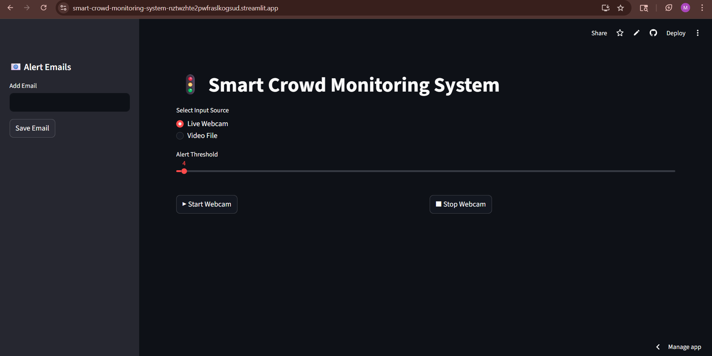
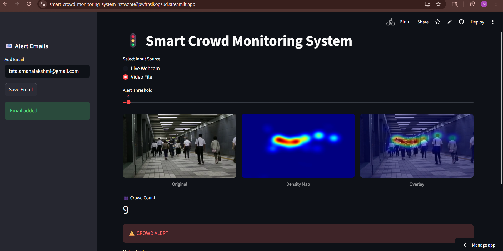
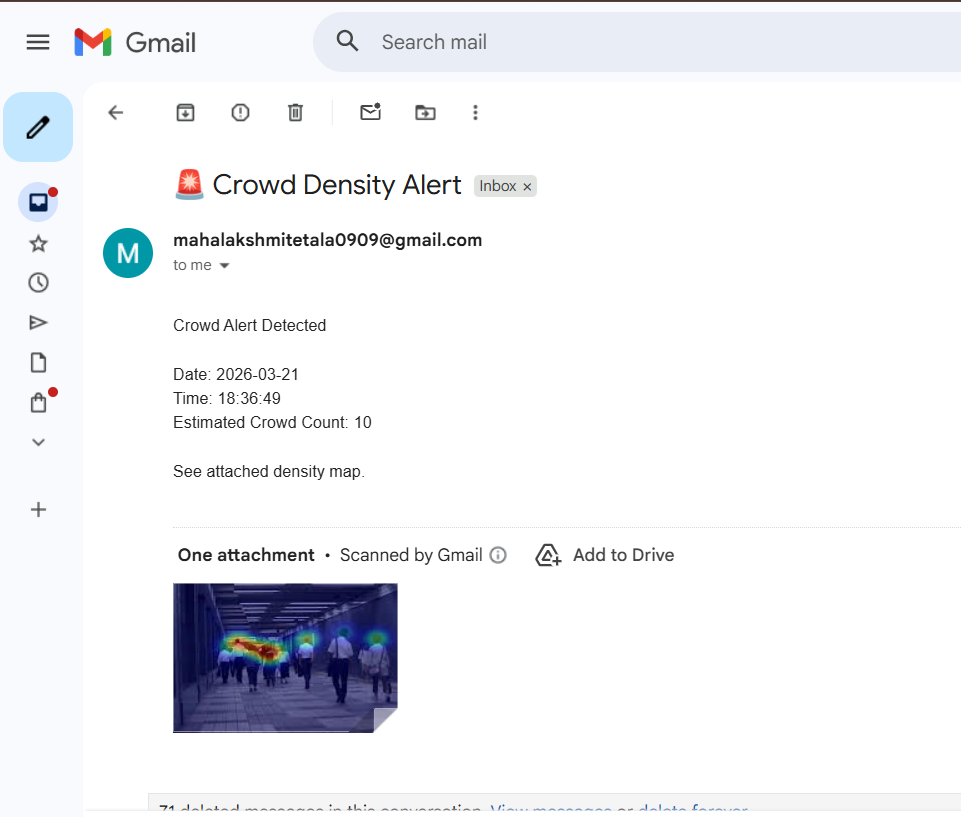

# Smart Crowd Monitoring System

AI-based real-time crowd density estimation using webcam or uploaded videos. Generates density heatmaps, estimates crowd count, and sends automated email alerts when crowd exceeds a set threshold.

🔗 **Live App:** [smart-crowd-monitoring-system.streamlit.app](https://smart-crowd-monitoring-system.streamlit.app)

---

## Features
- Real-time crowd density estimation (CSRNet + YOLO fusion)
- Webcam and video file input support
- Density heatmap and overlay visualization
- Configurable crowd threshold alerts
- Automated email alerts with screenshot attachment

## Tech Stack
Python · Streamlit · OpenCV · PyTorch · CSRNet · YOLOv8 · NumPy

## Screenshots

**Dashboard**

**Video Frame Output**

**Email Alert**

## Use Cases
Railway stations · Religious gatherings · Stadiums · Smart city surveillance · Stampede prevention

## Model
CSRNet model hosted on [Hugging Face](https://huggingface.co/mahaa2805/CSRNet_for_crowdmonitoring)
